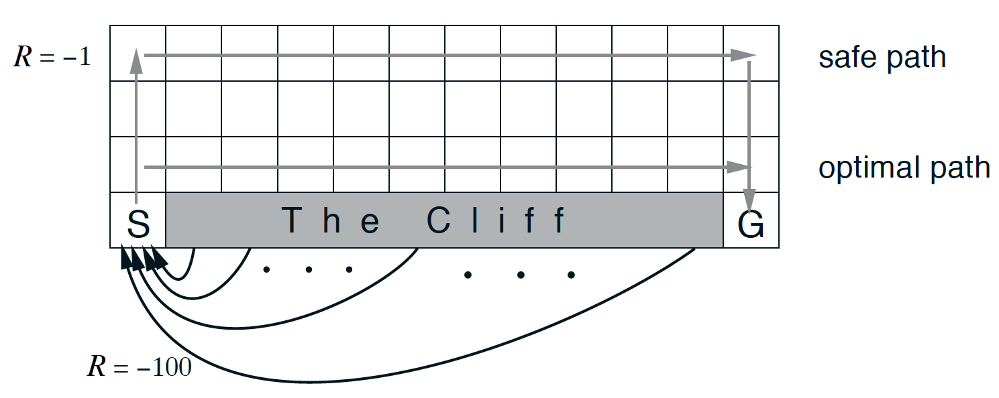
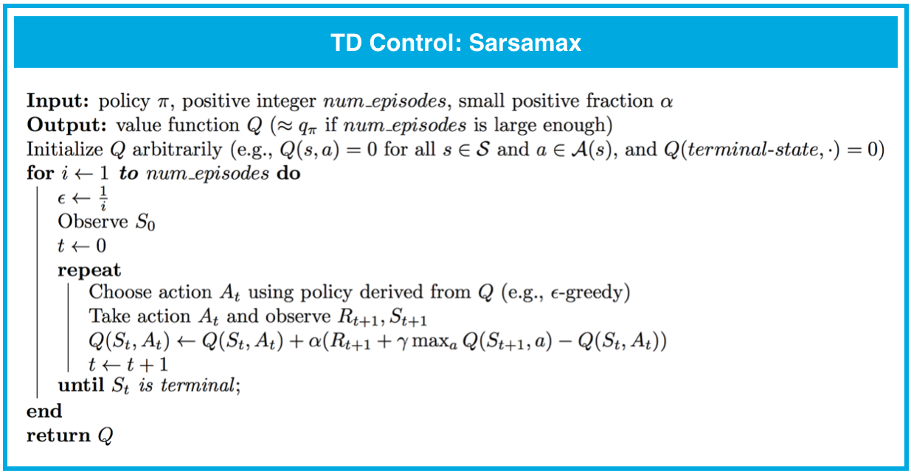

**Summary**

**The cliff-walking task (Sutton and Barto, 2017)**

**TD Prediction: TD(0)**

-   Whereas Monte Carlo (MC) prediction methods must wait until the end of an
    episode to update the value function estimate, temporal-difference (TD)
    methods update the value function after every time step.

-   For any fixed policy, **one-step TD** (or **TD(0)**) is guaranteed to
    converge to the true state-value function, as long as the step-size
    parameter \\alpha*α* is sufficiently small.

-   In practice, TD prediction converges faster than MC prediction.

**TD Prediction: Action Values**

-   (In this concept, we discussed a TD prediction algorithm for estimating
    action values. Similar to TD(0), this algorithm is guaranteed to converge to
    the true action-value function, as long as the step-size
    parameter \\alpha*α* is sufficiently small.)

**TD Control: Sarsa(0)**

-   **Sarsa(0)** (or **Sarsa**) is an on-policy TD control method. It is
    guaranteed to converge to the optimal action-value function q_\**q*∗​, as
    long as the step-size parameter \\alpha*α* is sufficiently small
    and \\epsilon*ϵ* is chosen to satisfy the **Greedy in the Limit with
    Infinite Exploration (GLIE)** conditions.

**TD Control: Sarsamax**

-   **Sarsamax** (or **Q-Learning**) is an off-policy TD control method. It is
    guaranteed to converge to the optimal action value function q_\**q*∗​, under
    the same conditions that guarantee convergence of the Sarsa control
    algorithm.
    
    

**TD Control: Expected Sarsa**

-   **Expected Sarsa** is an on-policy TD control method. It is guaranteed to
    converge to the optimal action value function q_\**q*∗​, under the same
    conditions that guarantee convergence of Sarsa and Sarsamax.
    

**Analyzing Performance**

-   On-policy TD control methods (like Expected Sarsa and Sarsa) have better
    online performance than off-policy TD control methods (like Q-learning).

-   Expected Sarsa generally achieves better performance than Sarsa.
